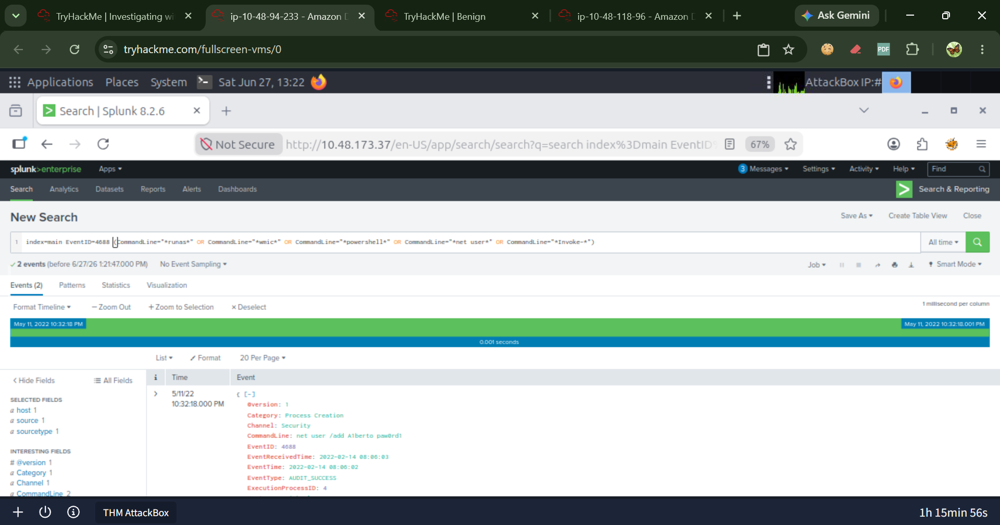

# Attack Timeline

Reconstructed from correlation of Windows Security Logs and PowerShell Operational Logs.

| Step | Event ID | Description | Screenshot |
|------|----------|-------------|------------|
| 1 | 4720 | Backdoor user account created |  |
| 2 | 4657 | Registry modified for persistence |  |
| 3 | 4648 | Attacker uses explicit credentials |  |
| 4 | 4688 | PowerShell launched with encoded payload |  |
| 5 | 4103 | Script Block Logging disabled |  |
| 6 | 4103 | AMSI bypassed |  |
| 7 | 4103 | WebClient created, payload downloaded |  |
| 8 | 4103 | RC4 decryption, in-memory execution (IEX) |  |
