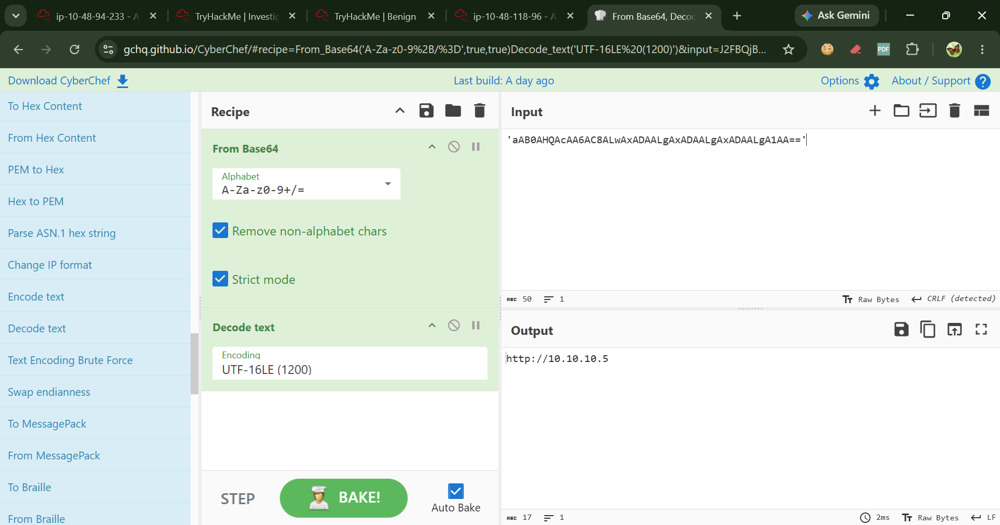

# Indicators of Compromise (IOCs)

Extracted from the decoded PowerShell payload discovered in Event ID 4103 logs.

## Network Indicators

| Type | Value |
|------|-------|
| C2 URL | `hXXp://192[.]168[.]1[.]105:8080/forum/index[.]php` — extracted during CyberChef decoding |
| Download Endpoint | `/forum/index.php` — discovered in decoded WebClient payload |
| User-Agent | Mozilla/5.0 (Windows NT 6.1; WOW64; Trident/7.0; rv:11.0) like Gecko |
| Cookie | KuUzuid=VmeKV5dekg9y7k/tlFFA8b2AaIs= |

## Host Indicators

| Type | Value |
|------|-------|
| Backdoor Account | `SupportAdmin` — created on `James.browne` (Event ID 4720) |
| Registry Key | `HKLM\SOFTWARE\Microsoft\Windows\CurrentVersion\Run\UpdateService` (Event ID 4657) |
| Malicious Process | powershell.exe with -enc flag |
| Download Method | System.Net.WebClient.DownloadData() |
| Decryption | RC4 |
| Execution | Invoke-Expression (IEX) |

## Defense Evasion Techniques

| Technique | Description |
|-----------|-------------|
| Script Block Logging disabled | Attacker patched registry to suppress PowerShell logging |
| AMSI disabled | In-memory patch to bypass antivirus scanning |
| Base64 encoding | Command line obfuscation |
| UTF-16LE encoding | Second encoding layer around PowerShell payload |
| Nested Base64 | C2 address hidden inside a second Base64 string |
