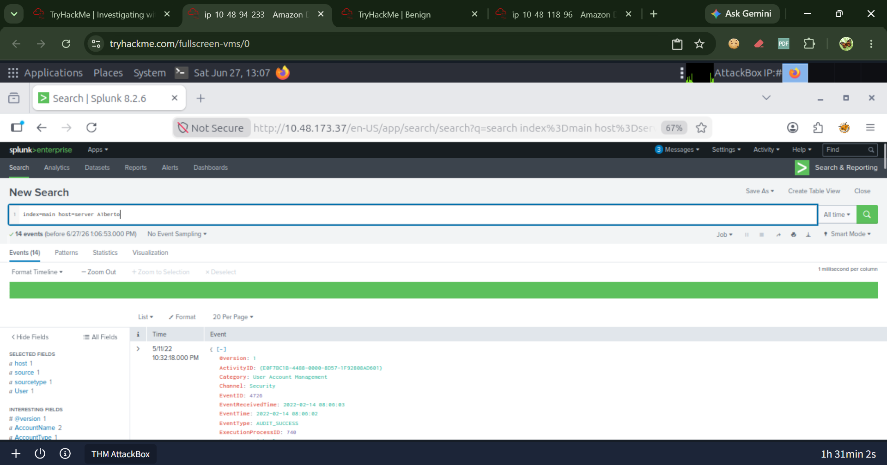

# MITRE ATT\&CK Mapping

Techniques observed during the Splunk investigation, mapped to the MITRE ATT&CK framework.

## Tactics & Techniques

| Tactic | Technique | ID | Evidence |
|--------|-----------|-----|---------|
| Execution | PowerShell | T1059.001 | powershell.exe -enc in Event ID 4688 / 4103 |
| Execution | Windows Management Instrumentation | T1047 | WMIC in Event ID 4688 |
| Execution | Command and Scripting Interpreter | T1059 | cmd.exe / net.exe in Event ID 4688 |
| Persistence | Create Account | T1136 | Event ID 4720 backdoor user |
| Persistence | Registry Run Keys / Startup Folder | T1547.001 | Event ID 4657 registry modification |
| Defense Evasion | Obfuscated Files or Information | T1027 | Base64 + UTF-16LE PowerShell encoding |
| Defense Evasion | Modify Registry | T1112 | Script Block Logging disabled via registry |
| Defense Evasion | Impair Defenses: AMSI Bypass | T1562.001 | AMSI patched in memory |
| Defense Evasion | Indicator Removal on Host | T1070 | Script Block Logging and AMSI disabled |
| Command & Control | Ingress Tool Transfer | T1105 | WebClient.DownloadData() from C2 |
| Credential Access | Use Alternate Authentication Material | T1550 | Event ID 4648 explicit credentials |

## Key Screenshots

| Technique | Evidence |
|-----------|----------|
| **PowerShell (T1059.001)** |  |
| **Create Account (T1136)** |  |
| **Modify Registry (T1112)** |  |
| **Obfuscated Files (T1027)** |  |
| **Ingress Tool Transfer (T1105)** |  |

## Reference

- [MITRE ATT&CK Framework](https://attack.mitre.org/)
